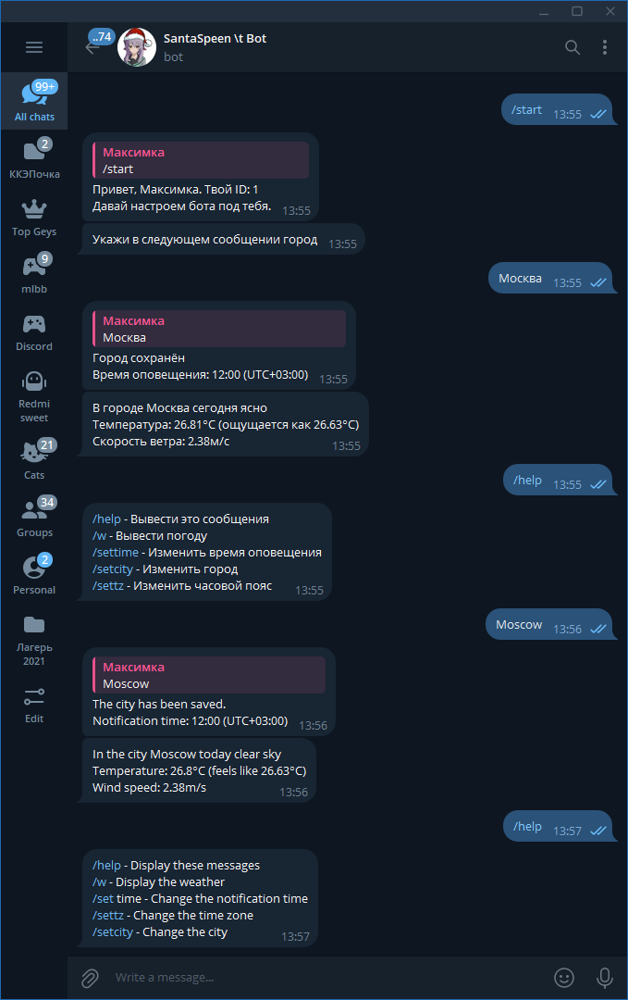

# WetaherBrat

## Настройка

Файл `config.yml` будет автоматически сгенерирован при первом запуске

```yaml
telegram:
  token: BOT_TOKEN_HERE  # Bot token
  admin: ADMIN_ID  # tg_id of admin user

weather:
  token: OWM_TOKEN_HERE # OpenWeatherMap API token

database:
  type: SQLITE  # SQLITE; MYSQL; PGSQL
  file: data.db
                   
i18n:
  dir: translates  # Directory for i18n
  default: auto  # Default language
```

## Мультиязычность

Бот поддерживает мультиязычность, считывается язык чата из телеграм, и применяется

* [ru.yml](./src/translates/ru.yml)
* [en.yml](./src/translates/en.yml)
* [el.yml](./src/translates/el.yml)
* [de.yml](./src/translates/de.yml)

## Пример работы бота:

